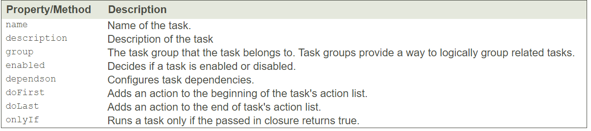
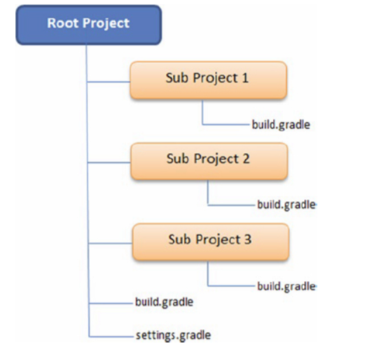

Gradle Build automation tool

## Table of Contents

* [Introduction](#introduction)
* [Reasons to Gradle Popularity](#reasons-to-gradle-popularity)
* [Features of Gradle](#features-of-gradle)
* [Three things need to know about Gradle](#three-things-need-to-know-about-gradle)
* [Hello Gradle world Example](#hello-gradle-world-example)
* [Understanding Gradle Builds](#understanding-gradle-builds)
	*  [Project](#project)		
	*  [Task](#task)
* [Multi-Project Builds](#multi-project-builds)	
* [References](#references)

## Introduction

1. Traditional software development typically involves writing code, compiling code, running tests, and assembling an archive that finally gets deployed or distributed. 

2. As software projects became more complex, additional steps such as running static code analysis, conditional inclusions of resources, 
   and running security scans have become part of the mainstream build and deployment process
   
3. Build automation tools allow you to automate these steps.

4. Gradle is popular open source build automation tool. Its first version (0.7) was released in 2009, followed by version 2.0 in 2014. 

## Reasons to Gradle Popularity

1. Gradle automation build tool is more popular because of it’s **performance and options of customization**.

2. Several high-profile projects such as Android, Spring Framework, and Hibernate have migrated their build systems to use Gradle. 
   Spring framework and Hibernate migrated their build systems to Gradle, mainly because of its high performance

3. Gradle has been used as build automation tool for many number of programming languages. Some of them are Java, Andorid, C++, Groovy, Kotlin and Scala. 
   As per documentation, Gradle call it as General purpose build automation tool. That means it is not specific to any particular programming language. 

4. Please refer below Gradle manual to find differences between Gradle & Maven in terms of performance
   https://gradle.org/maven-vs-gradle/
   

## Features of Gradle

Below are general featues of Gradle. 
 
1. **Declarative Dependency Management**:  Gradle provides option to define dependencies of Project in build script file with dynamic versions. Same feature can be found in 
   Maven as well. Dynamic version is nice feature adhere by users when exact version of dependency is unknown.   

2. **Declarative Builds**
   Gradle uses a Groovy (http://groovy-lang.org/) based domain specific language (DSL—see https://docs.gradle.org/current/dsl/) for declaring builds. 
   Gradle provides option to define the build script using Kotlin as well. Spring framework uses DSL to define build scripts. 
   
3. **Build by Convention**   
   Gradle provides sensible defaults and conventions for Java, Groovy, web, Scala, Android, and OSGi projects. For example, Gradle recommends that all the production source code for a Java project reside under the folder src\main\java. In the same way, it has recommendations for where the test code and resources should go. Additionally, default tasks get configured automatically for a Java project that would compile the code, and then run, test, and generate a JAR artifact. 
   
   Adhering to these conventions would make the build scripts very concise. However, you are not limited to follow these conventions. Since the Gradle's DSL is based on Groovy, it is easy to write Groovy code to tweak and deviate from these conventions.
   
4. **Incremental Builds**
   Complex projects often run into slow build times as the build tool tries to "clean" and rebuild everything. Gradle addresses this problem by providing incremental builds that skip the execution of a task if neither the inputs nor the outputs have changed. For example, the JavaCompile task takes a set of Java source files as input and generates a set of class files. Gradle uses this information to check if the source files have changed and if no changes are detected, the task gets skipped.
   
5. **Gradle Wrapper**
   Gradle Wrapper is simply a batch file (gradlew.bat) in the Windows environment and a shell script for Linux/Mac environments. When it runs, the wrapper script downloads and installs a fresh copy of Gradle runtime on the machine and executes a Gradle build. Gradle Wrapper makes it easy to spin up new continuous integration (CI) servers that can run builds without any additional configuration. The wrapper also makes it easy to distribute code and collaborate with others, as the recipients can easily build it.

6. **Plugins**
   Gradle makes it easy to augment and customize its functionality through plugins. Plugins are distributable components that encapsulate reusable build and task logic. Using plugins, it is possible to support additional languages, create new tasks, or modify existing task functionality and extend build language by adding new keywords. With Gradle, you can easily create your own plugins, thereby enabling you to integrate tasks and workflows that are specific to your organization.

7. **Open source**
   Gradle is open source and costs nothing to download and use. It comes with rich online documentation and the support of an active community. Additionally, Gradle Inc. offers consulting and commercial support for the Gradle ecosystem.
   
**Note**
  Extensive information about Gradle featues can be found here https://gradle.org/features/

**Summary:
Gradle greatly simplifies the build process and automates build management.**

## Three things need to know about Gradle

1.  **Gradle is a general-purpose build tool**
	
	*  Gradle allows you build any software.
	*  Users can use any programming language to develop software and Gradle can be used as build automation tool 

2.  **Building block of Gradle is Task**

	*  Gradle builds a task graph based on project. This task graph called as Directed Acyclic Graphs (DAGs). 
	*  Based on this graph, Gradle executes tasks in a order 
	*  Below are examples of Gradle task graphs. 
		

			
		

	
	* Every build process will be modeled as graph of tasks as like shown above. This is one of the reason to call **Gradle as so flexible**.

	* **Tasks graphs can be defined by both plugins and build scripts with tasks linked together via task dependency mechanism**
	
	* Every task consists below. However below are optional for some of the tasks. 
	
	   *  Actions — pieces of work that do something, like copy files or compile source
	   *  Inputs — values, files and directories that the actions use or operate on
	   *  Outputs — files and directories that the actions modify or generate

	
3.  **Gradle build phases**

	*  Initialization
          
		  *  Sets up the environment for the build and determine which projects will take part in it.

	*  Configuration
		  
		  *  Constructs the task graph for the build and then determines which tasks need to run and in which order, based on the task the user wants to run.

	*  Execution
          
		  *  Runs the tasks selected at the end of the configuration phase.

**Note:**  Please refer here for important things to know about Gradle https://docs.gradle.org/current/userguide/what_is_gradle.html#five_things
		  

		  
## Hello Gradle world Example

1. The best way to generate simple Gradle project is using Gradle command line utility.

2. By default every Gradle build script provides below tasks 
    * a. init 						-			Initialize Gradle project. [It's like git init]
    * b. wrapper                   	-			Generate Gradle wrapper files. It takes version as input 
	* c. various Help tasks 

3. Below screenshot shows Gradle default tasks 
	

	
    

4. Below screenshot shows to generate hello world gradle project using gradle init task 
	

	
    
	

5. gradle init task generates below files in directory 
     *  a. build.gradle
	 *  b. gradlew
	 *  c. gradlew.bat
	 *  d. settings.gradle
	 *  e. gradle/wrapper/gradle-wrapper.jar 
	 *  f. gradle/wrapper/gradle-wrapper.properties
      
6. Below screenshot shows the files generated by the gradle init command-line utility 
	

	
    

7. Please refer more information about hello gradle world project here https://github.com/rk-ramakrishna/Gradle-Fundamentals/tree/master/gradle-samples#hello-gradle-world-example
	  
 

## Understanding Gradle Builds   
   
1. Central to Gradle are two basic building blocks **Projects and Tasks**

2. **Every Gradle build is made up of one or more projects and each project contains one or more tasks**

   **Project**
	
	* A project in Gradle is an abstract concept that represents an artifact that needs to be built. 
	  
	* For example, a Gradle project could be a Java application that gets assembled into a JAR file or a Gradle project that can move some artifacts to repository
    
	* A Gradle project can also represent a piece of work that needs to be accomplished. For example, a Gradle project can be used to deploy an application.
			
	* From technical stand point of view, each project in the build Gradle creates an instance of org.gradle.api.Project and associates it with the build script. 
	  This allows the build scripts to use Project's API to access properties and customize build behavior at runtime (for example, by creating new tasks or skipping existing tasks).		
	  
	* Below are commonly used Project API properties and Methods
	
		

			
		

    * To access Project API's properties/methods, you can use the **implicit variable project** that Gradle associates with the build file.
	
	* **Example:**  
		project.description = "Hello World Project"   
		println "Project Description ${project.description}"  
		
	* **Tip**
	  Gradle by default looks for a build.gradle file to run a build. It is possible to create build files with different names. In order to trigger builds using those files, you need to use the command line option -b or --build-file, followed by the file name. 
	
	* It is possible to define additional project-level properties using the **syntax <<name>> =<< value>>** inside an **ext {} closure** or 
	  using the shortcut **ext.<<name>>=<<value>>.**
	
	* **Example:**    
		description = "Hello World Project"     
		println "Project Description ${description}"     
		ext {                                            
		outputLang = "English"                           
		}                                                  
		ext.environment = "local"                               
		println "Output Language: ${project.outputLang}"          
		println "Environment: ${environment}"                      
		
    * Please refer display of project properties example here   https://github.com/rk-ramakrishna/Gradle-Fundamentals/tree/master/gradle-samples#project-properties-example		

   **Task**
	
	* **Gradle projects are made up of one or more tasks that perform build steps.**
	
	* **A Task represents a single atomic piece of work for a build, such as compiling classes or generating javadoc.**
	
	* Each task has a name, which can be used to refer to the task within its owning project, and a fully qualified path, which is unique across all tasks in 
      all projects.
	 
    * The path of the task is the concatenation of the owning project's path and the task's name. Path elements are separated using the ":" character 	 
	
	* **Every single task has a list of actions that are executed while the task is run**

	* **doFirst and doLast methods are used to add an action at the beginning or to the end of the list respectively** 
	
	* **Tip**
	  If you use Groovy to implement Gradle scripts you may also spot << which is nothing else than an alias for doLast method. It’s been already deprecated and scheduled to be removed, however it still remains quite popular.
	
	* It’s possible to add multiple actions to a task, however it is rare.

	* **Tasks execute actions such as compile Java source code and generate classes or clean target folders.**	
	
	* **It is quite possible for tasks to depend on other tasks. For example, the task that runs test cases is dependent on the task that compiles Java code**.
	
	* Below are syntax to define task in Gradle file 
     
	   **task myTask** 								   
       **task myTask { configure closure }**           
	   **task myTask(type: SomeType)**                 
	   **task myTask(type: SomeType) { configure closure }**       	

    * Gradle supports two ways to create a new Task 
   
      * use the various methods on TaskContainer to create and lookup task instances
	  * use the task keyword in your build file

    * **Corresponding to each task in the build file, Gradle creates an instance of org.gradle.api.Task. By default it would be org.gradle.api.DefaultTask class**.
	
	* Below are commonly used task-related API properties and methods.
	
		

			
		

	
    * Please refer various examples of defining Gradle tasks here   https://github.com/rk-ramakrishna/Gradle-Fundamentals/tree/master/gradle-samples#project-properties-example	 
	
	* using Gradle DSL notation existing tasks can be accessed.  Below is an example 
			
			task hello {
				doLast {
					println 'Hello world!'
						}
				}
			hello.doLast {
				println "Greetings from the $hello.name task."
			}
    
	*  You can define own properties at task level. To add a property named myProperty, set ext.myProperty to an initial value. Below is an example 
	
				task myTask {
						ext.myProperty = "myValue"
							}	

				task printTaskProperties {
							doLast {
								println myTask.myProperty
								}
						}

## Multi-Project Builds

1. Often Entreprise projects are complex and contains multiple projects grouped under single root project 

2. Gradle supports to create Entreprise projects by allowing multiple projects nested under single root project 

3. **The root project allows you to define commmon dependencies, plugins and build logic instead of spreading across multiple projects** 

4. The typical hierarchically structured multi project shown in below diagram 

	

			
	

	
5. In Gradle, enable or disable of subprojects done in **settings.gradle file**. Below is example of enablement of subprojects. 

	**include 'web', 'service', 'repository'    or**      
	**include 'web'**       		
	**include 'service'**       
	**include 'repository'**     

6. In Gradle symbol : used to indicate the project hierarchy.For example, :service indicates that the service project is one level below the root (referred implicitly without a name).
   If your project exists under service/soap/util, then it will be referred to using :service:soap:util.

7. Multi-Project vs. Single-Project Gradle Builds   
	
	*	In Multi projects, root project build.gradle file used to trigger the build of complete application 
	
	*	Gradle finds settings.gradle file and then verify it continas any include statements. 
	    If settings.gradle contains any include statements then Gradle execute build as Multi project otherwise single project build 
		
8. Multi project builds often contains shared configuration such as plugins, dependencies, tasks etc 

9. Below is an example. All projects sharing common group name and version 
	
	**allprojects {**						 						
		**group = "com.apress.gradle"**		 
		**version = "1.0.0-SNAPSHOT"**		 
	**}**									 
	
10. Similarly if all subprojects are java projects with same repository, then we can define like below 

	subprojects {
     apply plugin: 'java'

		repositories {
          mavenCentral()
		}
	}

11. **Note:	The allprojects block should be used to declare attributes/configuration/tasks that apply to all projects. IDE plugins are good examples of plugins 
    that can be declared inside the allprojects section.**

12. It is also possible to configure behavior specific to a single subproject in the root project's build.gradle like below. 

	**project (':service') {**			 
		**apply plugin: 'java'**		 
	**}**								 

	**project (':repository') {**		 
		**apply plugin: 'java'**		 	
	**}**								 

	**project(':web') {**				 
		**apply plugin: 'war'**			 
	**}**								 
	
	
	

## References

	* Gradle user guide https://docs.gradle.org/current/userguide/userguide.html
	
	* Gradle documentation about Gradle project & tasks     https://docs.gradle.org/current/userguide/tutorial_using_tasks.html#sec:projects_and_tasks
	
	* Introducing Gradle by  Balaji Varanasi and Sudha Belida Apress © 2015		
	